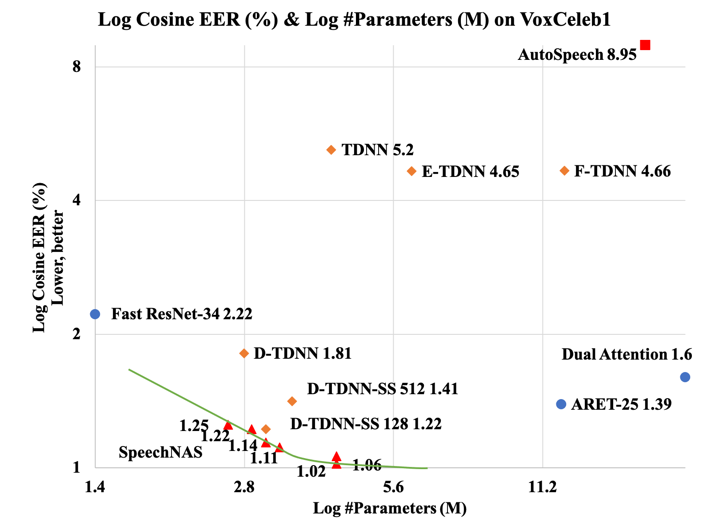

# speechnas
SpeechNAS-Better-Trade-off-between-Latency-and-Accuracy-for-Large-Scale-Speaker-Verification

ASRU 2021 IEEE Automatic Speech Recognition and Understanding

If this repository is useful to you, please cite our work properly. Thank you!
SpeechNAS-Better-Trade-off-between-Latency-and-Accuracy-for-Large-Scale-Speaker-Verification, ASRU 2021.

# Environment
Set up the environment for the reposity by
* PyTorch 1.7+

# Check configuration
Check configuration in `./config/`

# infer
```shell
bash metric/metric_eer/auto_run.sh
```
Recently, x-vector has been a successful and popular approach for speaker
verification, which employs a time delay neural network (TDNN) and statistics
pooling to extract speaker characterizing embedding from variable-length
utterances. Improvement upon the x-vector has been an active research area, and
enormous neural networks have been elaborately designed based on the x-vector,
eg, extended TDNN (E-TDNN), factorized TDNN (F-TDNN), and densely connected
TDNN (D-TDNN). In this work, we try to identify the optimal architectures from
a TDNN based search space employing neural architecture search (NAS), named
SpeechNAS. Leveraging the recent advances in the speaker recognition, such as
high-order statistics pooling, multi-branch mechanism, D-TDNN and angular
additive margin softmax (AAM) loss with a minimum hyper-spherical energy (MHE),
SpeechNAS automatically discovers five network architectures, from SpeechNAS-1
to SpeechNAS-5, of various numbers of parameters and GFLOPs on the large-scale
text-independent speaker recognition dataset VoxCeleb1. Our derived best neural
network achieves an equal error rate (EER) of 1.02% on the standard test set of
VoxCeleb1, which surpasses previous TDNN based state-of-the-art approaches by a
large margin.


